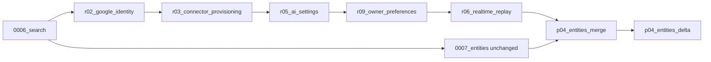

# P04 migration compatibility entry ruling

Date: 2026-10-01. Narrow source/design ruling. No migration, database/runtime probe, production edit, Git/index operation, build or test was performed. Only this scratch report is written.

## Decision

**Retain the exact historical `0007_entities` revision and its `down_revision="0006_search"`; add an explicit empty merge with the actual integrated R06 head; put reconciled P04 schema changes in a following delta.** This is the safe default while application history is unknown. Do not reparent, rename, overwrite or replace the old table-creation revision.

The source evidence does not establish whether any database applied `0007_entities`. Historical status calls P04-T1 in progress; its ignored SDD progress records the original revision choice and code/build-only stage, with no P04 migration execution receipt. Earlier phase migration successes are not evidence about this draft. Untracked file status is not application history.

Compatibility therefore resolves the entry decision without claiming to resolve unknown live database state. Runtime migration acceptance remains deferred.

## Verified original and integrated parents

- Original: `D:/Project/Umwelt-OS-phase-4/infrastructure/postgres/migrations/versions/0007_entities.py`.
- SHA256: `09E02930E58C6F437EF8614664FA084E57E10555A7E00EA40D02634B8927D0BD`.
- Original upgrade creates `entities`, `entity_aliases`, `relationships`, `relationship_evidence` and their indexes/constraints. Its downgrade drops those tables. No idempotent table-existence fallback is present or needed for a properly recorded revision.
- Current integrated root source after controller merge `35fc0c5` contains `r06_realtime_replay`, whose parent is `r09_owner_preferences`. Existing chain: `0006_search -> r02_google_identity -> r03_connector_provisioning -> r05_ai_settings -> r09_owner_preferences -> r06_realtime_replay`.
- Those reconciled migrations do not create the four historical entity tables. The branches share source/document prerequisites at `0006_search`; original entity-table FKs refer to existing sources/document versions/chunks. Their schema responsibilities do not collide.
- Current Compose migration command is `alembic upgrade head`, so the completed delivered graph must have one final head; shipping only the original revision alongside R06 would leave two heads.

## Precise proposed revision DAG



These new IDs are proposed unused P04 revision names, not current artifacts:

```python
# Empty merge revision: no schema/data writes in upgrade or downgrade.
revision = "p04_entities_merge"
down_revision = ("r06_realtime_replay", "0007_entities")
branch_labels = None
depends_on = None

# Reconciled forward delta.
revision = "p04_entities_delta"
down_revision = "p04_entities_merge"
branch_labels = None
depends_on = None
```

Keep original `0007_entities.py` bytes intact in the target migration directory. The merge has `pass` upgrade/downgrade; it joins revision ancestry and must not recreate tables or stamp branch versions manually. Delta owns all new columns/tables/indexes/constraints/backfills. Further P04 schema revisions can follow delta linearly as needed; they do not revise either parent.

Refresh the actual final R04/R06 migration head before implementing. If a later integrated revision descends from R06, use that actual sole head as the merge's integrated parent rather than leaving an unrelated extra head. Reviewed R04 currently adds no migration; the inspected current head is R06.

## Upgrade behavior for both histories

| Correctly recorded database state | Alembic forward path to final head |
| --- | --- |
| Fresh database / common ancestor before the fork | Apply shared ancestors, both branches (order need not be assumed), merge, delta. Original four tables are created once. |
| `r06_realtime_replay` only; old 0007 never applied | Apply the missing `0007_entities` branch from the shared ancestor, then merge and delta. Do not replay already-applied R02–R06. |
| Historical `0007_entities` only | Recognize the unchanged historical ID and skip its upgrade. Apply the missing R02–R06 branch, then merge and delta. Existing entity rows/IDs survive. |
| Both branch heads recorded in alembic_version | Join them at merge, then delta. Neither table-creation branch reruns. |
| Already at merge/delta | Normal later upgrades; applied revisions are not repeated. |

This relies on normal Alembic revision tracking, not table existence heuristics. An unversioned/partially created schema, falsely stamped revision, modified old migration, or missing prerequisite table is a different inconsistent state. No repository-only ruling can silently repair it safely: preserve data, stop on a descriptive mismatch and obtain explicit database/schema history during the deferred operational gate. Do not use `IF NOT EXISTS`, catch duplicate-table errors, stamp-to-head, reset, downgrade/re-upgrade, or drop/recreate to conceal such mismatch.

## Delta responsibilities and preservation rules

The follow-up delta implements the already-approved P04 owner schema; this ruling adds no architecture or new service:

1. Preserve all existing entity, alias, relationship and relationship-evidence IDs, references and stored values. Add consumed entity-owned memberships/supports, correction/redirect/provenance and durable extraction schema as specified by the entry ruling and actual implemented model contracts. Metadata registration retains R06/auth/source/document/connector/search/settings models and adds the P04 owners.
2. Add relationship endpoint membership bindings and derived alias support/confidence without treating existing RelationshipEvidence IDs as entity-membership IDs. Existing alias source_id alone cannot yield an exact chunk/extractor support. Do not fabricate document references, extraction candidates, model identities or entity extraction records merely to fill new fields.
3. New owner writes require authenticated actor/reason/server time. Historical rows lacking actor/protected-decision evidence retain explicit unknown/legacy provenance; do not backfill actor=1 or turn created_at into proof of a correction action. Historical `confirmed` remains its existing identity flag, not invented audit evidence.
4. Derived relationship confidence can be recomputed from existing valid supports using the ruled maximum remaining-support value. Preserve owner confidence as unknown where absent. Existing unsupported derived rows, missing endpoint assignments or alias supports must be retained as unresolved historical data pending controlled reconciliation; they must not be published as newly verified facts or silently erased to satisfy stronger constraints. Use a narrowly defined legacy/unresolved representation or staged constraint enforcement consumed by the owner, while enforcing full invariants for new active writes.
5. Tightening NOT NULL/FK/check/uniqueness constraints requires deterministic nonfabricated backfill and validation of historical rows first. Preserve duplicate/conflicting legacy identity for explicit owner correction; do not deduplicate destructively or infer merges from normalized names. A controlled conflict/legacy state is preferable to data loss or an invented support assignment.
6. Data deletion remains a separate actual owner transaction: document/source deletion cleans memberships/supports/unsupported derived facts and stale sourced text under public contracts before the R06 terminal commit. Migration compatibility is not a substitute for this consumer, and preserved legacy rows do not authorize deleted-source evidence exposure.

For a never-applied database these legacy concerns are vacuous: unchanged 0007 creates empty tables, then delta produces the final schema. For an already-applied database the delta makes missing historical provenance/support explicit and preserves existing data until controlled reconciliation. Do not create replacement copies of the original four tables under new names merely to avoid the revision DAG.

## Entry and verification boundary

Implement original revision + merge + forward delta as one coherent migration graph before exposing the transferred routers. Compare models to that final schema and review the actual migration SQL/source; all original IDs remain available for stale references and corrections. Source/build review does not execute or prove upgrades/downgrades.

Deferred migration acceptance should cover fresh, R06-only, historical-0007-only and two-head states with seeded legacy rows, preserving IDs/counts/relationships and verifying the sole final head. Those checks are recorded requirements only; none were created or run in this code/build stage.

This default compatibility path removes the need to assume that historical 0007 was never applied. Preserve the historical checkout/ignored evidence as in P04-transfer-inventory.md; root can proceed with selective transfer against the actual integrated base using this DAG.
